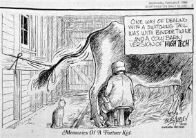
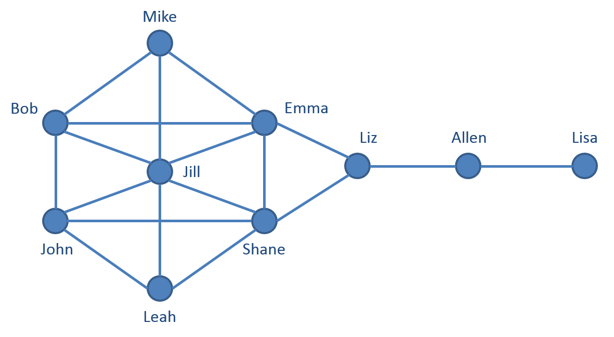
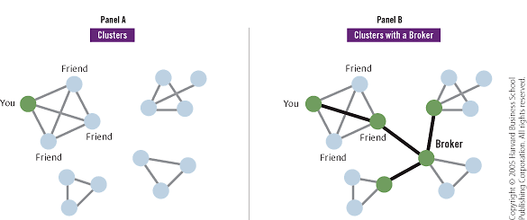

**How do you keep an organization motivated and committed?** This is a question that I had to ask myself when I was in a leadership role within one of the largest cross-discipline student groups at my undergrad campus. It ends up the answer was **simple**, but I took an analytical, high-tech, approach to find the simple, low-tech, answer.

Throughout a majority of my undergrad I was involved in a student organization that focused on making differences in our communities through entrepreneurship and innovation while building skills to become socially responsible business leaders. It was the first organization that I joined while on campus and I ended up being selected to the presentation team for our national competition–the youngest to do so. Being selected as the only non-graduating member of the presentation team gave me a fairly high-profile among the 100+ student members. This eventually led to them selected me as the president for the following year.

As the newly elected president, I tried to take a high level view of some of the largest issues that the organization will face in years to come. The first issue that I noticed was the lack of membership retention and involvement. At the beginning of each year we would have over 100 members, which would quickly dip below the 75, 60, or 50 mark by the time winter break came around. Of those that stayed, only a small portion were considered “active”–we defined active as attending 90% of meeting, leading a project, or contributing 10 project hours a semester. As an organization that touted itself as “the largest cross-discipline organization on campus”, I found those numbers abhorrent. **The way towards future success depended on an active membership body**, and a clear, defined, development plan for students seeking leadership roles.

Fortunately, one of my VPs was a great friend, my room-mate, and a coworker–we spent a lot of time together. In our job, we worked with a professor to conduct organizational network analyses for large Fortune 100 companies to discover the true structure of their organization–who employees thought of as leaders, who they went to for advice, who they trusted, and who they saw on a frequent basis. **If this analysis worked for for-profit companies seeking to further their organization, we thought it would also work for a student organization in desperate need of help.**

It did. We found a surprisingly _simple_ answer to our _complex_ issue.

As the president I was privy towards the inner workers of the organization and inner metrics which would prove useful as additional information, but in order to get a whole picture I would need relationship level data. For this, we put together a simple questionnaire that had members list up to 15 people that they know from the organization, then we asked questions such as: “How frequently do you interact with this person?”, “How likely are you to go to this person for professional or project related advice?”, “How likely are you to go to this person for personal advice or with sensitive topics?”, etc. From these data points, we were able to construct an illustration of the organization’s network which ended up looking something like the photo below.

_This is an example of what the network would look like._

Each person is represented by a node. These nodes can be customized by color or shape to represent any attribute we have data on, such as year in school, area of study, gender, race, level in organization, and so on.

This view gives us a great visual representation of our organization. From this, we were able to see how fragmented the organization was, how many cliques were formed based upon nationality, area of study, etc., and how those who were closer to the center of the network were more involved with projects.
Later, we were able to calculate a few variables that measure the centrality of the individual, their eigenvalue measure, centrality betweenness, and a few others that essentially describe their placement within the network and their contribution to the network at an individual and network level. To be completely honest, I forget what many of these values truly indicated. However, at the time we were very diligent in making sure we understood what the numbers were indicating.

A few weeks later, we were able to review an updated roster of members, project hours contributed, and other important variables to determine who in the organization had left or were not heavily involved and used that as a time 2 roster. We were able to create a small predictive model that was able to predict whether an individual was going to leave the organization within the academic year based upon many of these measures**. The model was 87% accurate.** Not bad for a first model for a few college kids trying to have fun!

We quickly realized that those who were on the edges of the network–literally not within the inner circle of the organization–we most likely to leave the organization or not be involved. **The solution is to get people closer to the center of the network.** How? By taking a few minutes a day to reach out to people, sit down and have a cup of coffee with them, ask them how their classes are going, or asking them to help you with a project. **It was truly that easy.**

To make things easier on us–so we didn’t have to keep track of 100+ members–we targeted specific individuals called “brokers”. These are people who connect two people or smaller networks into the larger network as a whole–they are the glue that holds the network together. We realized that if we lose one broker, we could lose the entire network that they bring into the organization. So losing one person quickly turns to losing ten.

After targeting these powerful people and investing our time in building a strong network we were able to **increase membership retention and involvement by 47%** compared to previous years. We defined involvement similar to active members as attending 90% of meeting, leading a project, trying out for the presentation team, or contributing 10 project hours a semester. This means that rather than ending with around 50 members, we had 75. These 25 people are essential to the continued success of the organization and carrying momentum forward year over year.

From this experience I learned that you can analyze a problem in very complex, new, innovative ways and discover that the solution is much more simple or intuitive that you could have imagined.

Complex Issues and Simple Solutions. Sometimes they can surprise you.
