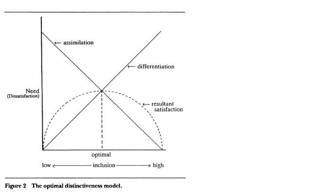
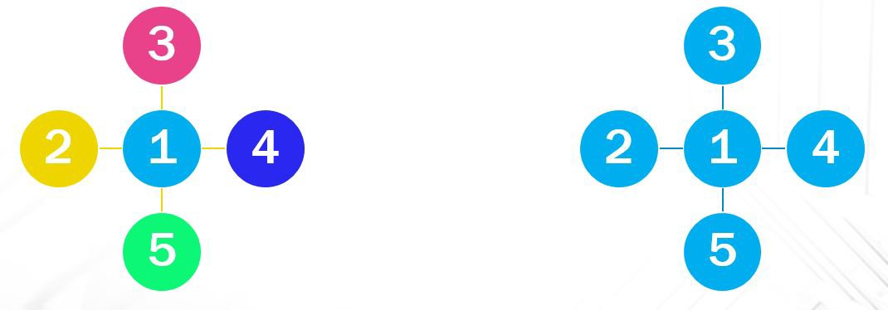
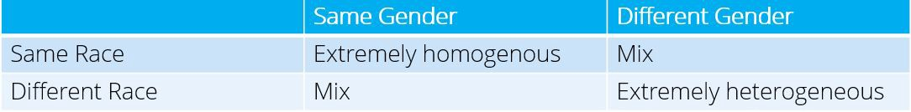

## Introduction
As an undergrad, I was able to work closely with an Organizational Behavior professor in a research lab. This was, by far, my favorite job I’ve had for dozens of reasons–one being, I was able to conduct studies on subjects that interested me. My senior year, I found a research topic that interested me, created and conducted my own experiments, and analyze my findings. Although I never had a chance to finalize the results in an academic medium, I still find the results fascinating.

The origins of this interest comes from Not James. I went to school with someone who looked vaguely similar to me, studied the same major as me, and was also at the top of every class. As people used to frequently think he was me (although no one seemed to mix me up for him) I jokingly referred to him as “Not James” and it caught on with my friends and some of the professors. For some reason, Not James frustrated me. The Organizational Behavior professor I worked for mentioned that it could be because I no longer felt unique and distinct.

I was curious as to why people made decisions that seemed out of character and stumbled upon an area of social phycology that deals with identity needs. One particular theory that interested me was the Optimal Distinctiveness Theory (Brewer 1991).

The Optimal Distinctiveness Theory is a “social psychological theory seeking to understand ingroup-outgroup differences. It asserts that individuals desire to attain an optimal balance of inclusion and distinctiveness within and between social groups”. Assume that the level of distinctness you feel–how unique you are compared to those around you–is on a continuous scale. The Optimal Distinctness Theory essentially states that there is a certain point where you feel one-of-a-kind, but not so unique that you do not fit in with a group. It is the optimal level of uniqueness and belonging; these two feelings are constantly in opposition with one another. This differs from person to person, and is constantly fluctuating depending on social situations.

What, specifically, was I interested in finding out? The role that Optimal Distinctiveness (the constant pull between the need to feel included, and the need distinct) plays in whistleblowing. Which group is more likely to have someone whistle blow?

In embarked on a multi-study research project, and what I found was quite fascinating. It was extremely fulfilling to have a theory, create experiments, and see the results.

## Study 1
My first study was small and focused in order to test my initial hypothesis before trying to create a more comprehensive experiment. This was an online survey taken by 66 undergraduate students at my university based on scenarios set forth in *What’s in it for Me? An Examination of Accounting Students’ Likelihood to Report Faculty Misconduct* (Jones, Sproekman, and Sanchez-Rodriguez 2014). Participants were split in two groups, one which was explicitly homogeneous (accounting student in intro accounting class with ONLY accountants), another was explicitly heterogeneous (accounting student in intro accounting class with diverse students)–the manipulation check was statistically significant at the 0.007 level.

They were given a scenario and asked a series of questions getting at the participants willingness to blow the whistle on other students for cheating. (i.e., “I would report…”, “the students should be punished…” etc..), which was turned into a Whistleblowing scale with a Cronbach’s Alpha of 0.872. Exactly as I initially predicted, participants in the homogeneous group were more likely to whistle blow than the heterogeneous group–at a 0.040 level!

This told me there may be social identity issues underlying the participant’s decisions, however I would need to conduct another study to confirm this.

This was a quick, dirty study to test an initial hunch, but the initial results were encouraging and led me to Study 2.

## Study 2
Study 2 had to be more comprehensive, have a larger sample size, and get at the underlying reasons for making a decision. After considerable research, I found previous studies which would help with the underlying social identify issues. The Personal Sense of Uniqueness Scale (Simsek, 2010) would allow me to determine how unique/distinctive the participant felt at the time of the study and the Need for Uniqueness Score (Syder and Fromkin, 1977) determined how unique the participant has I desire to feel –any difference would indicate an imbalance in their Optimal Distinctiveness level.

This study was conducted in person on a laptop by 106 Caucasian women (in order to control for gender and race later in the study). They were asked the Personal Sense of Uniqueness and Need for Uniqueness questions in addition to a series of questions about on their willingness to blow whistle on a range of wrongdoings of co-workers (i.e., using company laptop for personal business, cheating on exams in college, stealing from tip jar at restaurant, stabbing someone) after seeing one of the four photos depicting a group of coworkers, depending on randomly selected conditions.

This study confirmed my hypothesis. Again, participants who were put in homogenous groups were more likely to report wrongdoings than students who were in heterogeneous groups. However, with the new scales I was also able to determine that those with a higher Need for Uniqueness and a lower Personal Need for Uniqueness were more likely to whistle blow–meaning that if you have a higher need to be unique, but are not achieving that need you are more likely to blow the whistle in an effort to make yourself feel unique.

## Future Research
Unfortunately, I graduated before I was able to implement Study 3 or 4. These studies would have included a primer in an attempt to mitigate the effect between the need for uniqueness and whistleblowing and/or a field study to view this phenomenon in the real world rather than in an experiment setting.