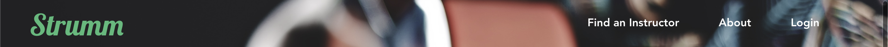

I’m building Strumm using Vue.js because I hate React and because Vue allows us to build a web app and leverage the built in Routers to make it multi-page. I’ll also use Tailwind CSS for styling.

## Creating the file

To create a new Vue project, I’m using Vue CLI and Vue UI. Navigate to the desired directory and run:

```javascript
vue create [project name]
```

Using Vue CLI I am including vue-router, babel, pwa, and eslint. 

After the project is created, `cd` into the newly created project and run:

```javascript
vue ui
```

In the ‘Dependencies’ section make sure you add Tailwind CSS. Back in the project you will need to create a new `main.css` file that is imported into the `App.vue`. Inside the `main.css` file just include:

```css
@tailwind base;
@tailwind components;
@tailwind utilities;
```

With that, we should be good to go.

## Setting Up a NavBar
With what we have out of the box, setting up a NavBar is pretty easy.  Create a components folder called `AppNav` and create `AppNav.vue`
```javascript
<template>
  <div class=“absolute w-full flex items-center justify-between px-12 nav-height”>
    <AppNavBrand />
    <div class=“flex justify-center”>
      <AppNavItem
        v-for=“(item, idx) in navItems”
        :key=“idx”
        :text=“item.text”
        :routePath=“item.routePath”
        :routeName=“item.routeName”
      />
    </div>
  </div>
</template>
<script>
import AppNavBrand from './AppNavBrand'
import AppNavItem from ‘./AppNavItem’
export default {
  name: ‘AppNav’,
  components: {
    AppNavBrand,
    AppNavItem
  },
  computed: {
    navItems () {
      return [
        {
          text: ‘Find an Instructor’,
          routePath: ‘/find-instructor’,
          routeName: ‘FindInstructor’
        },
        {
          text: 'About’,
          routePath: ‘/about’,
          routeName: 'About'
        },
        {
          text: 'Login',
          routePath: ‘/login’,
          routeName: ‘Login’
        }
      ]
    }
  }
}
</script>
<style scoped>
.nav-height {
  height: 80px;
}
</style>
```

Create a second file called `AppNavBrand.vue` with the following:

```javascript
<template>
  <div>
    <router-link to=“/“>
      <span class=“text-green-500 leading-none text-5xl strumm-name”>
        Strumm
      </span>
    </router-link>
  </div>
</template>
<script>
export default {
  name: ‘AppNavBrand’
}
</script>
<style>
.strumm-name {
  font-family: “Lobster”, cursive;
}
</style>
```

Lastly, create a third file called `AppNavItem.vue` with the following:

```javascript
<template>
  <router-link class=“mr-16 py-1” :to=“routePath”>
    <span
      class=“text-lg leading-none font-bold nav-transition w-1/3 border-b-4 border-transparent”
      :class=“[
        isRoot ? ‘text-white nav-transition-root’ : ‘text-gray-800’,
        isActive ? ‘text-gray-800 border-b-4 border-gray-800’ : ‘nav-transition-nonroot’
      ]”
    >
      {{ text }}
    </span>
  </router-link>
</template>
<script>
export default {
  name: ‘AppNavItem’,
  props: {
    text: {
      type: String,
      default: ''
    },
    routeName: {
      type: String,
      default: ''
    },
    routePath: {
      type: String,
      default: ‘’
    }
  },
  computed: {
    isRoot () {
      return this.$route.name === ‘Home’
    },
    isActive () {
      return this.$route.name === this.routeName
    }
  }
}
</script>
<style>
.nav-transition:after {
  display:block;
  content: ‘’;
  transform: scaleX(0);
  transition: transform 250ms ease-in-out;
}
.nav-transition:hover:after {
  transform: scaleX(1);
}
.nav-transition-nonroot:after{
  @apply border-b-4;
  @apply border-gray-800;
}
.nav-transition-root:after{
  @apply border-b-4;
  @apply border-white;
}
</style>
```
Now we have a functioning NavBar! 



-James