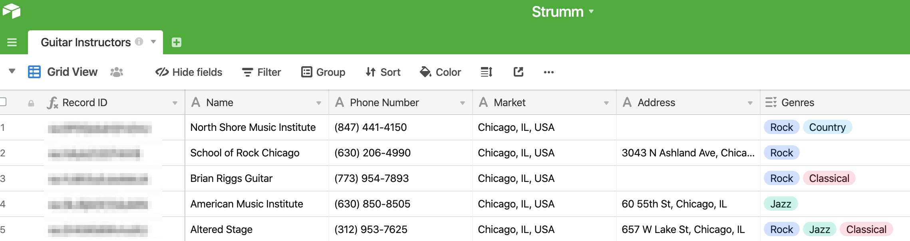

## What we are trying to do:
**I need maps and I need data.**

Maps should be easy.  I work for Google—Maps has over 1B users and has a robust team dedicated to making the product better.  Getting and using the data will require a bit more work, but to build the site I will need a subset of instructors to make sure everything works as intended.  To get a set of dummy data I will use Yelp and I will store it in Airtable.  Then I will use the Airtable API to show the instructors on Strumm.

## Yelp
I am 99% sure I did not do this the most efficient way, but I’m learning as I go along.  I know I want *real* data I can use to test my app.  Dummy data would do, but having actual instructor data would make this more exciting. 

So I built a web scraper for Yelp.

Why a web scraper and not use Yelp’s API?  I have no good reason other than when I pulled this I was uncomfortable with APIs but had built a few scrapers before.

Using Python I threw together this beauty to get the first few pages of results: 

```python
from bs4 import BeautifulSoup
import requests
import csv

style = input(“What lessons are you looking for?: “)
csv_name = style
style = style.replace(“ “, “%20”)

csv_file = open(‘guitarlessons.csv’, ‘w’)
csv_writer = csv.writer(csv_file)
csv_writer.writerow([‘Style’, ‘Name’,’Phone Number’, ‘Address’])

n=0
while n <= 50:

    source = requests.get(‘https://www.yelp.com/search?find_desc=‘ + style + “&find_loc=Chicago%2C%20IL&start=“ + str(n)).text

    soup = BeautifulSoup(source, ‘lxml’)

    for business in soup.find_all(‘div’, {‘class’: ‘lemon—div__373c0__1mboc standard__373c0__356Tp arrange__373c0__UHqhV border-color—default__373c0__2oFDT’}):
        for name in business.find(‘a’, {‘class’:’lemon—a__373c0__IEZFH link__373c0__29943 link-color—blue-dark__373c0__1mhJo link-size—inherit__373c0__2JXk5’}):
            name = name
        for phone in business.find(‘p’, {‘class’: ‘lemon—p__373c0__3Qnnj text__373c0__2pB8f text-color—normal__373c0__K_MKN text-align—right__373c0__3ARv7’}):
            phone = phone
        try:
            for address in business.find(‘address’).find(‘span’, {‘class’:’lemon—span__373c0__3997G’}):
                address = address + “, Chicago, IL”
        except:
            address = "n/a"
            pass
        csv_writer.writerow([csv_name, name, phone, address])
    n += 10

```

Now when I run `script.py` I get to select the type of search I want for Chicago.  I ran this a few times for different variations of guitar lessons — Jazz, Rock, Acoustic, Classical, County, and so on— until I had a list of ~200 different instructors.  I compiled the different csvs and began uploading onto Airtable.

## Airtable
I love Airtable.  Partly because it seems to be the hot new no-code tool, but also because I am a recovering accountant and it looks like a spreadsheet (Google Sheets > Microsoft Excel. Don’t @ me.).   They also make super easy custom API documentation for your datasets.

I created a new base for Strumm and added all the instructors I found using my Yelp scraper.  After a tiny bit of cleaning and aggregating, here is what I have:



Now onto bringing the Airtable data into my app.

First, follow the Airtable API Documentation to get an API key, then add it in your working folder as a `env.local` file.  For example, here is what it could look like. 

```
VUE_APP_AIRTABLE_BASE=APPBASE345678908765		//Enter your Base ID
VUE_APP_AIRTABLE_API=KEY234567897654				//Enter your API Key
```

I am using Vuex  to store my data ([read more here on how to setup](https://vuex.vuejs.org/guide/)).  I created a `state` folder, a `store.js` file, and a `modules` folder that includes a file called `instructor-module.js`.

I am also going to be using Axios, [which you can read more about here](https://vuejs.org/v2/cookbook/using-axios-to-consume-apis.html), to access Airtable’s API.

In `store.js` I have:

```javascript
import Vue from ‘vue’
import Vuex from ‘vuex’
import instructorModule from ‘./modules/instructor-module’
import axios from ‘axios’

Vue.use(Vuex)
Vue.use(axios)

export default new Vuex.Store({
  modules: {
    instructorModule: instructorModule
  }
})

```

Pretty simple.  Just setting things up.

Inside the `instructor-module.js` file things get a bit more interesting.  I won’t go into to much detail because Axios has a bunch of good resources out there.

```javascript
import axios from ‘axios’

const module = {
  state: {
    instructors: []
  },
  actions: {
    GET_INSTRUCTORS ({ commit }) {
      const baseKey = process.env.VUE_APP_AIRTABLE_BASE
      const apiKey = process.env.VUE_APP_AIRTABLE_API
      axios
        .get(`https://api.airtable.com/v0/${baseKey}`,
          {
            headers: {
              ‘Authorization’: `Bearer ${apiKey}`
            },
            params: {
              filterByFormula: `AND({Market} = ‘${geoModule.state.mapSearchSelection.formatted_address}’)`,
              view: ‘Known Address’
            }
          })
        .then(r => r.data.records)
        .then(instructors => {
          commit(‘SET_INSTRUCTORS’, instructors)
        })
    }
  },
  mutations: {
    SET_INSTRUCTORS: (state, instructors) => {
      state.instructors = instructors
    }
  }
}

export default module
```

Now we just need to actually call the API.  In my case, I will do that in my `FindInstructor.vue`  page.  I am calling the following method when my Google Map loads (covering this in a following post).

```javascript
…
<script>
  methods: {
    fetchInstructors () {
      this.$store.dispatch(‘GET_INSTRUCTORS’)
    }
…
</script>
```

WOOHOO!  Now Airtable is hooked up.

## Google Maps
Looking at the [Google Maps Documentation](https://developers.google.com/maps/documentation/javascript/tutorial), it looks like Google requires us to put our API key in the URL.  My buddy, [Keegan](https://github.com/kruebling), told me that is a big **no no**.

Luckily, I am not the only one that wants to use Google Maps in a Vue app.  I ended up using [Vue-Google-Maps](https://github.com/xkjyeah/vue-google-maps) mainly because the documentation was easy enough to follow and there seemed to be a bunch of examples I could follow on Stack Overflow. 

First, follow the [Google Maps Documentation](https://developers.google.com/maps/documentation/javascript/tutorial) to get an API key, then add it in your   `env.local` file.

For example, my file looks like this:
```
GOOGLE_MAPS_API = 123456789ABCDEFG		// Enter your own API key
```

Then, in your `main.js` file, update it to look like this:

``` javascript
import Vue from 'vue'
import store from './state/store'
import router from './router/router'
import * as VueGoogleMaps from 'vue2-google-maps'

// load shared styles
import '@/assets/styles/tailwind.css'

// load views
import ViewDefault from './views/ViewDefault.vue'

// load app
import App from './App.vue'

Vue.config.productionTip = false

// register views
Vue.component('ViewDefault', ViewDefault)

// 
Vue.use(VueGoogleMaps, {
  load: {
    key: process.env.VUE_APP_GMAP_KEY,
    libraries: 'geometry,drawing,places'
  }
})

new Vue({
  router,
  store,
  render: h => h(App)
}).$mount('#app')
```

Cool.  Now that Google Maps is hooked up with Strumm, let’s add a simple autocomplete input form first. 

I am building a component folder called `SearchBar` and creating a file  `SearchBar.vue` .

### Page Needs

1. `Input` to call the Google Maps API to autocomplete the city that the user is inputting.  
2. Once the user selects a city, I will store is in my Vuex store (probably will not cover on here.  [Email me](mailto:james@itsjamesmurray.com) if you need help.).  
3. After storing the city we should navigate pages to the `FindInstructor` pages  I do not want the submit button to show unless a valid city is chosen, and I also do not want to navigate to a new page without a valid city chosen.

For step 1:
```javascript
<template>
…
<input 
	ref=“autocomplete” 
	type=“text” 
	onfocus=“value=‘’”
/>
…
</template>
<script>
import { gmapApi } from ‘vue2-google-maps’
export default {
…
	computed: {
		google: gmapApi,
		…	
	},
	mounted () {
    this.$gmapApiPromiseLazy().then(() => {
      window.vueGoogleMapsInit(google)
      this.autocomplete = new google.maps.places.Autocomplete(
        this.$refs.autocomplete,
        { types: [‘(cities)’] }
      )
      this.autocomplete.addListener(‘place_changed’, () => {
        let place = this.autocomplete.getPlace()
        this.handleSelection(place)
      })
    })
	}
…
}
</script>
```

That should give you the ability to hookup your input to Google Maps API.  Now to store it… just look up how to use Vuex.  It isn’t that hard.

Finally, for navigating pages on a valid city selection.

```javascript
<template>
…
    <button
      :class=“isValid ? ‘A bunch of tailwind styling’ : ‘hidden’”
      @click=“isValid ? navToInstructor() : null”
    >
      <p>Search</p>
    </button>
…
</template>
<script>
…
  computed: {
    google: gmapApi,
    mapSearchSelection () {
      return this.$store.state.geoModule.mapSearchSelection
    },
    isValid () {
      if (this.mapSearchSelection.adr_address) {
        return true
      } else {
        return false
      }
    }
  },
	methods () {
    navToInstructor () {
      this.$router.push({
        name: ‘FindInstructor’
      })
	}
…
</script>

```

Therefore, in `SearchBar.vue` I have something like this:

```javascript
<template>
  <div>
    <input
      ref=“autocomplete”
      type=“text”
      placeholder=“Find an instructor in your city…”
      onfocus=“value = ‘’”
    />
    <button
      :class=“isValid ? ‘A bunch of tailwind styling’ : ‘hidden’”
      @click=“isValid ? navToInstructor() : null”
    >
      <p>Search</p>
    </button>
  </div>
</template>
<script>
import { gmapApi } from ‘vue2-google-maps’
export default {
  name: ‘SearchBar’,
  computed: {
    google: gmapApi,
    mapSearchSelection () {
      return this.$store.state.geoModule.mapSearchSelection
    },
    isValid () {
      if (this.mapSearchSelection.adr_address) {
        return true
      } else {
        return false
      }
    }
  },
  mounted () {
    this.$gmapApiPromiseLazy().then(() => {
      window.vueGoogleMapsInit(google)
      this.autocomplete = new google.maps.places.Autocomplete(
        this.$refs.autocomplete,
        { types: [‘(cities)’] }
      )
      this.autocomplete.addListener(‘place_changed’, () => {
        let place = this.autocomplete.getPlace()
        this.handleSelection(place)
      })
    })
  },
  methods: {
    handleSelection (payload) {
      this.$store.commit(‘SET_MAP_SEARCH_SELECTION’, payload)
    },
    navToInstructor () {
      this.$router.push({
        name: ‘FindInstructor’
      })
    }
  }
}
</script>
```

-James