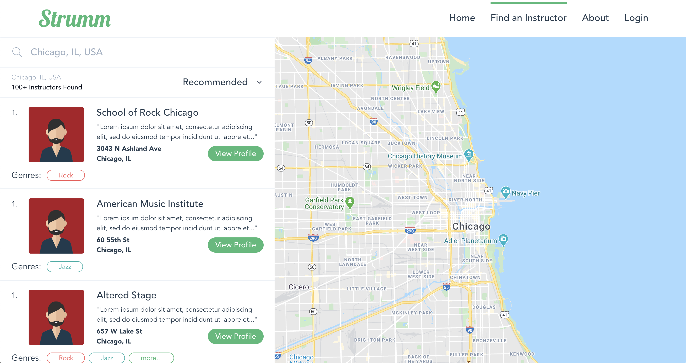

[I recently read that 90% of beginner guitar players give up within a year, according to Fender.](https://www.musicradar.com/amp/news/90-of-beginner-guitar-players-give-up-within-a-year-says-fender) That is crazy!

Hopefully, one-day Strumm can help out Fender. I assume that is why they had build Fender Play, but I wholly believe in-person instruction is much better than online, pre-recorded, content when trying to truly help new guitarists get past their first chords.

I’ve made a ton of progress since the last posting. So much so that it would be too much for me to fully chronicle. That being said, I have learned a ton!

Shout out to my buddy Keegan for reviewing my code and pushing me to do it right rather than simply solving my use case. An example of this is how he’s helped me make a new Strumm Component that I will be using on all of my pages.

## Home Page
The home page is the main landing page for Strumm outside of individual instructor profiles. It is something that I want to make strong and super easy for users to interact with.  From my time working with startups in my previous gig on the Accelerated Growth Team at Google, I know the impact that a strong landing page can have on user conversion rates.  

The problem: I know what I *don’t* like, but it is hard for me to put what I *do* like in practice.

That being said, I am pretty happy with the current version.


The initial input field I had for the Google Maps Autocomplete functionality looked stupid, so I tried to clean it up and even found a way to make the Autocomplete drop down a bit more ‘Strumm Branded’.

See below for the updated `AppPlaceSearch.vue` page:
```javascript
<template>
  <div class=“flex h-16 border-b-2 border-t-2 border-gray-200 bg-white relative”>
    <div class=“flex items-center”>
      <svg xmlns=“http://www.w3.org/2000/svg” viewBox=“0 0 50 50” class=“text-gray-500 fill-current ml-6 h-6 w-6 absolute left-0”>
        <path fill-rule=“evenodd” d=“M 21 3 C 11.621094 3 4 10.621094 4 20 C 4 29.378906 11.621094 37 21 37 C 24.710938 37 28.140625 35.804688 30.9375 33.78125 L 44.09375 46.90625 L 46.90625 44.09375 L 33.90625 31.0625 C 36.460938 28.085938 38 24.222656 38 20 C 38 10.621094 30.378906 3 21 3 Z M 21 5 C 29.296875 5 36 11.703125 36 20 C 36 28.296875 29.296875 35 21 35 C 12.703125 35 6 28.296875 6 20 C 6 11.703125 12.703125 5 21 5 Z”></path>
      </svg>
    </div>
    <input
      ref=“autocomplete”
      type=“text”
      onfocus=“value = ‘’”
      class=“w-full pl-16 rounded py-4 text-xl text-gray-800 placeholder-text-gray-500 font-medium outline-none”
      :placeholder=“formattedAddress”
    />
  </div>
</template>
<script>
import { gmapApi } from ‘vue2-google-maps’
export default {
  name: ‘AppPlaceSearch’,
  computed: {
    google: gmapApi,
    formattedAddress () {
      return this.$store.state.geoModule.mapSearchSelection.formatted_address
    },
    mapSearchSelection () {
      return this.$store.state.geoModule.mapSearchSelection
    }
  },
  mounted () {
    this.$gmapApiPromiseLazy().then(() => {
      window.vueGoogleMapsInit(google)
      this.autocomplete = new google.maps.places.Autocomplete(
        this.$refs.autocomplete, {
          types: ['(cities)'],
          componentRestrictions: { country: 'us' }
        })
      this.autocomplete.addListener('place_changed', () => {
        let place = this.autocomplete.getPlace()
        this.handleSelection(place)
        this.routerQueryUpdate()
      })
    })
  },
  methods: {
    handleSelection (payload) {
      if (payload) {
        this.$store.commit('SET_MAP_SEARCH_SELECTION', payload)
        this.$store.dispatch('getInstructors', payload.formatted_address)
      }
    },
    routerQueryUpdate () {
      const location = this.$store.state.geoModule.mapSearchSelection.formatted_address
      this.$router.push({
        path: '/find-instructor',
        query: { market: location }
      })
    }
  }
}
</script>
<style>
/* FIXME: use tailwind */
.pac-item {
  @apply h-16;
  line-height: 4rem;
}

.pac-item-selected {
  @apply bg-blue-100;
}

.pac-item:hover {
  @apply bg-blue-100;
}

.pac-item, .pac-item-query {
  @apply text-base;
  font-family: 'Avenir', Helvetica, Arial, sans-serif;
}

.pac-icon {
  @apply hidden;
}
</style>

```

In the above, I am trying to figure out how to use a single custom component for inputs, but allow some to access the Google Maps API if needed. It all works now, but I think I can make it cleaner if I needed to.

I like the big bold call to action and the super-easy action for a user to search. In the future, I will have more content beneath the hero image discussing the full offerings. 

## Find Instructor Page [Map View]
For a typical user, I expect this to be the page that most time is spent on when searching for an instructor.  There are a ton of good examples here that I can pull from like Airbnb, Redfin, etc.  It doesn’t take a rocket scientist to know that having a map on a page focused on location is a pretty big deal.



I have some dummy data for Chicago, but the next step I am working on is building out a more structured database which will make things more structured. Currently, I have it set up to only pull data if the user search is equal to the city listed on the instructor's page which works in my single universe, but I am thinking of using some sort of latitude/longitude geocoding or broader regional way of searching. I also need a few smaller things like adding indicators on the map for the location of the instructor.

## Server-Side Rendering
This was harder than I thought it would be.  But I am proud that I realized it would be a problem before I got too far along.

A Vue app injects HTML using Javascript.  Indexing bots (like Googlebot for organic search results) do not always run Javascript.  So oftentimes, my site looks like it has no content to these bots.  To solve this, I built a server-side rendering Firebase function that is run when the user-agent is a bot.

See below for the main section of code I used to solve this:

```javascript
const functions = require(‘firebase-functions’)
const cors = require(‘cors’)({ origin: true })
const express = require(‘express’)
const app = express()
app.use(cors)

const puppeteer = require(‘puppeteer’)
const renderer = require(‘./renderer’)
const fetch = require(‘node-fetch’)

const baseURL = ‘MYFIREBASEURL’
const renderURL = ‘MYFIREBASEFUNCTIONSURL’

exports.render = functions.runWith({ memory: ‘1GB’ }).https.onRequest(async (request, response) => {
  const browser = await puppeteer.launch({
    headless: true,
    args: [‘—no-sandbox’, ‘—disable-setuid-sandbox’]
  })

  const requestURL = request.query.requestURL

  const page = await browser.newPage()
  const { status, content } = await renderer.serialize(page, requestURL, false)

  response.status(status).send(content)
})

exports.ssr = functions.https.onRequest(async (request, response) => {
  const bots = [
    ‘twitterbot’,
    ‘facebookexternalhit’,
    ‘linkedinbot’,
    ‘pinterest’,
    ‘slackbot’,
    ‘googlebot’
  ]

  const userAgent = String(request.headers[‘user-agent’])
  console.log(`Request from ${userAgent}`)

  const isBot = bots.filter(bot => userAgent.toLowerCase().includes(bot)).length

  const requestURL = baseURL + request.url
  console.log(`Request URL is: ${requestURL}`)

  const options = { timeout: 0 }

  if (isBot) {
    const html = await fetch(`${renderURL}?requestURL=${requestURL}`, options)
    const body = await html.text()
    response.send(body.toString()))
  } else {
    const html = await fetch(baseURL)
    const body = await html.text()
    response.send(body.toString()))
  }
})


```

I’m not 100% sure it is the most effective way to solve the problem— I do not know if this will scale— but it solved the problem I had.  For my blog (the site you are on now) I used a similar tactic and built a dynamic sitemap for Google indexing and it seems to be working.

## More to do

I am still learning. But I am proud that I have not blown through this to just do what I want but to learn what I am doing, why I am doing it, and the pros and cons of my approach.

I’ve got a ton on my list to keep working on, so I am nowhere near close.  However, I would like to get this up and running for real users by the end of summer.

As I told a manager on my team at work, this has also had a huge amount of spillover from my day job. So this has been a win-win-win.

-James